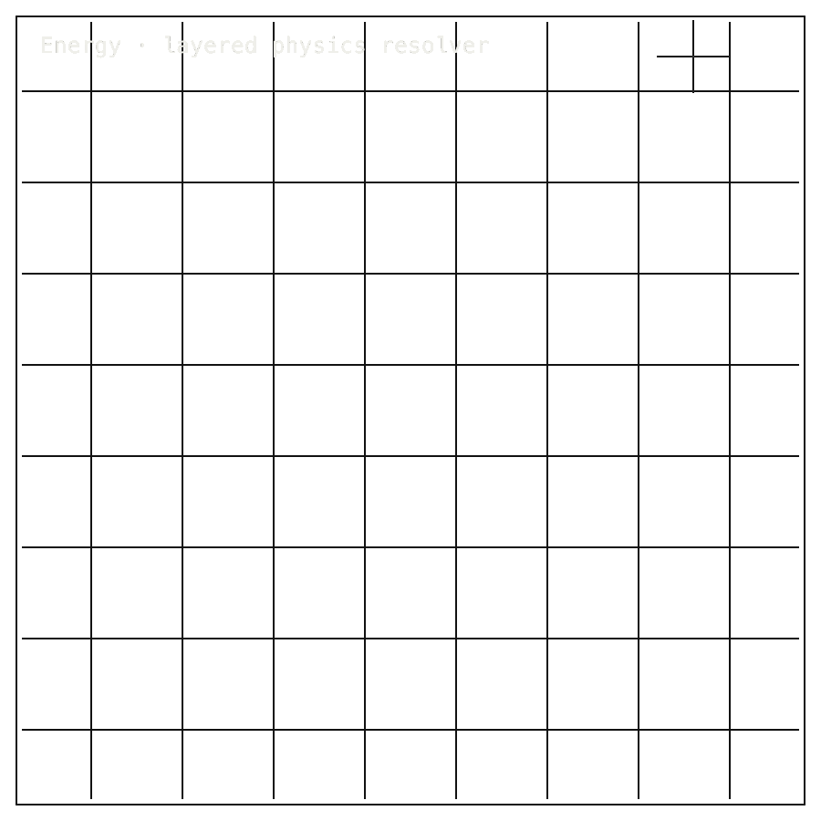

# Energy-Physics-Pipeline

## Install / Developer Commands

<!-- INSTALL-DX:START -->
#### Package Install

Installable package: `python3.11 -m pip install energy-physics-pipeline`.
Current release: `0.1.0` on [PyPI](https://pypi.org/project/energy-physics-pipeline/).
Source: [Zer0pa/Energy-Physics-Pipeline](https://github.com/Zer0pa/Energy-Physics-Pipeline/).

```bash
python3.11 -m pip install energy-physics-pipeline
```

Import smoke:

```bash
python3.11 - <<'PY'
import importlib.metadata as md
import energy_physics_pipeline

print("energy-physics-pipeline", md.version("energy-physics-pipeline"))
PY
```


CLI smoke:

```bash
energy-physics --help
```

Install success only proves package acquisition/import. Product scope, stale PyPI state, platform limits, and blockers remain in the front-door sections below.
- PyPI project URLs are incomplete and PyPI copy is stale; install success is not product readiness.
<!-- INSTALL-DX:END -->

#### Quick Start

```bash
git clone https://github.com/Zer0pa/Energy-Physics-Pipeline
cd Energy-Physics-Pipeline
python3.13 -m venv .venv
.venv/bin/pip install -e '.[test,tda,mcp]'
.venv/bin/pip install pybamm pybop pypsa pvlib cantera pyscf netCDF4 freegs omas pyrokinetics qiskit mcp ripser persim
ENERGY_AUDIT_DIR=$(mktemp -d) ENERGY_KG_DIR=$(mktemp -d) bash scripts/full_check.sh
energy-physics --help
```

Runpod migration starts by setting `ENERGY_RUNPOD_BASE_URL` and flipping the target layer with `ENERGY_L?_BACKEND=runpod_rest`. The enterprise completion standard is in [`H100-ENTERPRISE-COMPLETION-PLAN.md`](./H100-ENTERPRISE-COMPLETION-PLAN.md).

<table width="100%">
<tr>
<td width="100%" valign="top">
<div><span><b>00 · ENERGY</b> · IN-SILICO PHYSICS PIPELINE</span> <span>RESEARCH-READY · H100 WAVE OPEN</span></div>
      <h1>CPU-backed energy <span>baseline.</span></h1>
      <p>In-silico physics pipeline &middot; electrochemistry to fusion &middot; Energy-Physics-Pipeline</p>
      <p>Energy research groups need a reproducible baseline before they spend H100 budget. Energy-Physics-Pipeline organizes six in-silico layers &mdash; <strong>electrons, atoms, mesoscale, device, stack, orchestration</strong> &mdash; across electrochemistry and fusion/plasma research, all running on commodity CPUs today. <strong>475 of 475 strict CPU tests pass at 79.72% coverage; 39 of 39 source manifests verify; 6 of 6 anchors resolve.</strong> H100 execution remains untested. This is research infrastructure, not a deployable energy product.</p>
</td>
</tr>
</table>

<table width="100%">
<tr>
<td width="100%" valign="top">
<figure>
        <div></div>
        <figcaption><b>Scope:</b> CPU baseline across six in-silico layers. 475 strict tests, manifests, and anchors pass; H100 evidence is not yet claimed.</figcaption>
      </figure>
</td>
</tr>
</table>

<table width="100%">
<tr>
<td width="100%" valign="top">
<div><b>01 · THE GAP</b> <span>CPU BASELINE FIRST</span></div>
      <h2>&ldquo;Energy teams need a reproducible CPU baseline before GPU/H100 physics runs carry weight.&rdquo;</h2>
</td>
</tr>
</table>

<table width="100%">
<tr>
<td width="100%" valign="top">
<div><b>02 · MARKETS</b> <span>USER GROUPS</span></div>
      <div>
        <div>
          <div><span>Fusion / plasma research</span>  <span>$496.7B '31</span></div>
          <div><span>Hydrogen generation</span>  <span>$316.5B '30</span></div>
          <div><span>Fuel-cell modeling</span>  <span>$17.9B '30</span></div>
          <div><span>Computational chemistry</span>  <span>$13.7B '30</span></div>
          <div><span>Battery software</span>  <span>$8.9B '30</span></div>
        </div>
      </div>
      <div>Adjacent energy-transition forecasts; this pipeline is research infrastructure, not a deployable energy product or certification claim.</div>
</td>
</tr>
</table>

<table width="100%">
<tr>
<td width="50%" valign="top">
<div><b>03 · VALUE OF MARKET</b></div>
      <div>475<span>/475</span> <span>PASS</span></div>
      <div>Six layers run end-to-end on commodity CPUs, <b>before any GPU hour is spent.</b></div>
</td>
<td width="50%" valign="top">
<div><b>04 · INSIGHT</b></div>
      <h2>475 / 475 CPU pass. <span>GPU execution still untested.</span></h2>
</td>
</tr>
</table>

<table width="100%">
<tr>
<td width="50%" valign="top">
<div><b>05.0 · CURRENT TECH</b> <span>POINT TOOLS + HPC</span></div>
        <p>Battery, electrochemistry, and fusion teams each run mature solvers &mdash; but in separate stacks, with separate manifests, separate result formats, and separate notions of which version of which dataset was actually used.</p>
</td>
<td width="50%" valign="top">
<div><b>05.1 · OUR TECH</b> <span>CPU-FIRST BASELINE</span></div>
        <p>Energy-Physics-Pipeline ships one CPU-first stack across six layers &mdash; <strong>electrons, atoms, mesoscale, device, stack, orchestration</strong>. Source manifests resolve at known SHAs, electrochemistry and fusion runs share the same execution path, and the same code path will run on GPU once cluster time arrives. <strong>A research engineer can re-run the full chain on a laptop.</strong></p>
</td>
</tr>
</table>

<table width="100%">
<tr>
<td width="100%" valign="top">
<div><b>05.2 · BENCHMARKS</b> <span>STRICT FULL CHECK</span></div>
      <div>
        <div>
          <div><span>Strict</span><b>475 / 475</b><small>tests PASS</small></div>
          <div><span>Coverage</span><b>79.72</b><small>% of source</small></div>
          <div><span>Sources</span><b>39 / 39</b><small>verified, 0 miss</small></div>
          <div><span>Anchors</span><b>6 / 6</b><small>resolve</small></div>
        </div>
        <div>
          <div><span>CPU strict</span>  <span>475/475</span></div>
          <div><span>Source verify</span>  <span>39/39</span></div>
          <div><span>Cutover hooks</span>  <span>staged</span></div>
        </div>
      </div>
      <div><b>Open work:</b> H100 enterprise wave untested &mdash; 180&ndash;500 GPU-hours pending real cluster time.</div>
</td>
</tr>
</table>

<table width="100%">
<tr>
<td width="34%" valign="top">
<div><b>06 · MEASUREMENT</b> <span>STRICT FULL + SOURCE VERIFY</span></div>
      <h2>CPU results come first; <span>GPU runs are still untested.</span></h2>
</td>
<td width="66%" valign="top">
<div><b>06.1 · BOUNDED VALIDATION ON STRICT CPU CHAIN</b></div>
      <div>
        <div>
          <div><span>CPU strict</span>  <span>475 / 475</span></div>
          <div><span>Source verify</span>  <span>39 / 39</span></div>
          <div><span>Runpod cutover hooks</span>  <span>staged</span></div>
          <div><span>H100 execution wave</span>  <span>0 / 180&ndash;500 hrs</span></div>
        </div>
      </div>
      <div>Strict CPU check plus source verification across all six layers &middot; 39 of 39 manifests resolve at known SHAs &middot; GPU execution path wired but unrun &middot; H100 wave open at 180&ndash;500 GPU-hours.</div>
</td>
</tr>
</table>

<table width="100%">
<tr>
<td width="100%" valign="top">
<div><b>07 · KEY METRICS</b> <span>STRICT FULL CHECK + SOURCE VERIFY</span></div>
</td>
</tr>
</table>

<table width="100%">
<tr>
<td width="100%" valign="top">
<div><b>07.1 · CPU STRICT CHECK</b></div>
      <div>475/475<span>PASS</span></div>
      <div>Strict full check · <b>0 miss</b></div>
</td>
</tr>
</table>

<table width="100%">
<tr>
<td width="100%" valign="top">
<div><b>07.2 · COVERAGE</b></div>
      <div>79.72<span>%</span></div>
      <div>Of source · <b>strict full check</b></div>
</td>
</tr>
</table>

<table width="100%">
<tr>
<td width="100%" valign="top">
<div><b>07.3 · SOURCE MANIFESTS</b></div>
      <div>39/39<span>OK</span></div>
      <div>Verified at known SHAs · <b>0 miss</b></div>
</td>
</tr>
</table>

<table width="100%">
<tr>
<td width="100%" valign="top">
<div><b>07.4 · H100 BUDGET</b></div>
      <div>180&ndash;500<span>HRS</span></div>
      <div>H100 execution · <b>not yet run</b></div>
</td>
</tr>
</table>

<table width="100%">
<tr>
<td width="100%" valign="top">
<div><b>07.5 · PIPELINE LAYERS</b></div>
      <div>6<span>layers</span></div>
      <div>Electrons through <b>orchestration</b></div>
</td>
</tr>
</table>

<table width="100%">
<tr>
<td width="100%" valign="top">
<div><b>08 · DETERMINISM</b> <span>FROZEN-INPUTS · CPU CHAIN</span></div>
      <h2>CPU layer outputs <span>re-derive from frozen inputs.</span></h2>
</td>
</tr>
</table>

<table width="100%">
<tr>
<td width="66%" valign="top">
<div><b>08.1 · WHAT DETERMINISTIC MEANS</b> <span>STRICT-FULL · SAME ENDPOINTS</span></div>
      <p>Across all six layers &mdash; electrons through orchestration &mdash; current results are <strong>reproducible from frozen inputs on commodity CPU</strong>. Source manifests resolve at known SHAs, and Runpod cutover hooks preserve the same endpoint shape for later GPU runs.</p>
      <p>Unit of bit-exactness: <em>per-layer, against strict-full on a fresh venv</em>. <strong>H100 enterprise work must later pass CPU-vs-GPU regression against real GPU artifacts</strong> before it can claim parity with the CPU baseline.</p>
</td>
<td width="34%" valign="top">
<div><b>08.2 · THE FIDELITY GAP</b></div>
      <span>Honest Blocker &middot;</span>
      <p><strong>No GPU-backed enterprise completion wave has run yet.</strong> PyPI remains at <strong>energy-physics-pipeline 0.1.0</strong> with stale text; 0.1.1 is pending. Smoke tests and shaped envelopes are not completion. <strong>No production, regulatory, or defense claim.</strong> 180&ndash;500 H100-hours are owed before this becomes a GPU-backed result.</p>
</td>
</tr>
</table>

<table width="100%">
<tr>
<td width="33%" valign="top">
<div><b>09</b> </div>
      <h2>ONE STACK FROM ELECTRONS TO <span>FUSION.</span></h2>
</td>
<td width="67%" valign="top">
<div><b>09.1 · THIS REPO'S AMBITION</b></div>
      <p>The ambition is one public energy-computation workbench that a fusion lab, an electrochemistry group, and a grid-physics modeler can all extend without forking. CPU baselines, GPU execution, source manifests, and domain routing share one architecture so the science argument stays about physics, not tooling.</p>
</td>
</tr>
</table>

<table width="100%">
<tr>
<td width="33%" valign="top">
<div><b>09.2 · WHAT WORKS NOW</b></div>
        <h2>Working now: CPU strict baseline, source manifests at known SHAs, domain routing, and Runpod GPU cutover staged.</h2>
</td>
<td width="67%" valign="top">
<div><b>09.3 · WHAT'S STILL OPEN</b></div>
        <h2>Still open: H100 execution wave, PyPI 0.1.1 release, GPU-comparison artifacts, and broader domain data.</h2>
</td>
</tr>
</table>

<table width="100%">
<tr>
<td width="100%" valign="top">
<div><b>09.4</b> &middot; RELEASES · NEAR-TERM (12&ndash;24 MO)</div>
      <div>Public package matches the working repo</div><div>A research engineer evaluating tools no longer has to choose between a stale PyPI page and a fresher GitHub. Procurement, software audits, and library-of-record decisions can use the same identity the running pipeline carries.</div>
</td>
</tr>
</table>

<table width="100%">
<tr>
<td width="100%" valign="top">
<div><b>09.5</b> &middot; ELECTROCHEMISTRY · NEAR-TERM (12&ndash;24 MO)</div>
      <div>Battery and hydrogen runs gain a shared yardstick</div><div>A battery-materials group and a hydrogen-electrolyzer group can compare numbers across the same six-layer chain instead of arguing about toolchains. CPU baselines settle the methodology argument before either team spends device-cluster hours.</div>
</td>
</tr>
</table>

<table width="100%">
<tr>
<td width="100%" valign="top">
<div><b>09.6</b> &middot; FUSION · MID-TERM (24&ndash;48 MO)</div>
      <div>GPU plasma runs inherit the CPU receipt</div><div>When H100 fusion and plasma work lands inside the same execution path, scale stops weakening evidence. A national lab can attach the GPU run, the CPU comparison, and the source manifest to the same record a reviewer will read.</div>
</td>
</tr>
</table>

<table width="100%">
<tr>
<td width="100%" valign="top">
<div><b>09.7</b> &middot; DOMAINS · MID-TERM (24&ndash;48 MO)</div>
      <div>Energy domains stop forking their stacks</div><div>Battery research, fuel-cell modeling, and fusion teams stop maintaining bespoke pipelines for queueing, source manifests, and result tables. A shared workbench means a postdoc moves between domains without learning a new operations stack.</div>
</td>
</tr>
</table>

<table width="100%">
<tr>
<td width="100%" valign="top">
<div><b>09.8</b> &middot; GRID · PARADIGM (48 MO+)</div>
      <div>Energy R&amp;D ships the whole run, not the result</div><div>Funders, regulators, and grid planners stop reviewing a single number. They review the run object &mdash; inputs, environment, source SHAs, comparisons, boundary notes &mdash; and decide what to fund or interconnect against an artifact they can re-run themselves.</div>
</td>
</tr>
</table>
